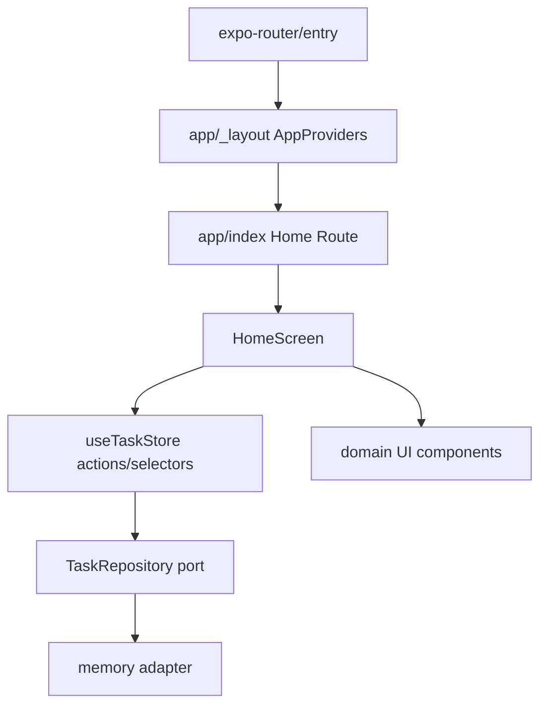

# Mobile Foundation 设计

## 0. 术语约定

| 术语 | 定义 | 防冲突结论 |
|---|---|---|
| App Shell | 路由、全局 Provider、安全区和状态栏的最外层组合 | 替代当前 `App.tsx` 同时承担所有职责的结构，不代表业务页面 |
| Route Screen | `app/` 下由 Expo Router 挂载的薄页面 | 只编排模块，不承载领域状态和数据库操作 |
| Module | `src/modules/{domain}` 下围绕一个业务域组织的类型、store、actions 和 UI | 与 roadmap 模块名一致，不建立万能 `utils` |
| Repository Port | 模块访问持久化或远端数据的稳定接口 | 本 feature 只定义接口和内存 adapter，SQLite 在下一 feature 实现 |
| Characterization Test | 固定现有原型可见行为的测试 | 防止拆文件时把结构改动误当成功能改动 |

## 1. 决策与约束

### 需求摘要

把 `apps/mobile/App.tsx` 的 700+ 行原型拆成技术文档建议的 `app/` 与 `src/` 结构，建立 Expo Router、领域模块、Zustand 内存 store、repository port 和测试基线，同时保持现有 M0 用户行为不变。

成功标准：项目通过 typecheck、单元/组件测试和 Android export；首页、任务添加、按任务启动、倒计时、完成/退出和锁机禁用边界仍可运行；下一 feature 能在不改页面协议的情况下接入 SQLite。

### 明确不做

- 不实现 SQLite schema、迁移、离线同步或重启恢复。
- 不实现新的任务字段、三种计时、账号、后端、真实锁机或新页面流程。
- 不改变 HeroUI 视觉语义、现有示例数据和产品文案，除非为测试稳定性修正可访问 label。
- 不创建空的未来模块目录；后续 feature 按需增加。

### 复杂度档位

走移动端基础架构默认档位；结构改动范围大但业务行为保持不变，验证优先级高于新增能力。

### 关键决策

1. 使用 Expo Router：技术文档明确建议 `app/_layout.tsx` 与路由目录；根入口改为 `expo-router/entry`。
2. Route Screen 保持薄层：任务和会话状态由模块 store/action 管理，页面不直接修改数组。
3. Zustand 只承载内存状态与动作；repository port 在本 feature 可替换，SQLite adapter 留给 `local-task-focus-loop`。
4. 保持 granular HeroUI imports，避免同项目混用聚合导入。
5. 测试使用 Expo 对应版本 runner 和 React Native Testing Library；不新增伪造 runner 或自定义 shim。

### 风险与缓解

- 路由入口变更导致 bundle 失败：先按 Expo SDK 57 文档安装并验证 router，再移动页面。
- 结构拆分改变会话状态：用 characterization tests 覆盖任务身份、完成/退出和锁机禁用。
- 抽象过度：repository 仅暴露下一 feature 确实需要的任务与会话接口，不建通用 base repository。

### 基线与必跑命令

- 当前基线：`npm run typecheck` 与 Android Expo export 通过；没有自动化测试。
- 必跑：`npm run typecheck`、`npm test -- --runInBand`、`npx expo export --platform android --output-dir .expo-export-check --clear`。

## 2. 名词与编排

### 2.1 名词层

#### 现状

- `apps/mobile/App.tsx`：同时定义 `Task`、`ActiveSession`、`FocusSessionRecord`、全部状态、业务动作和 12 个 UI 组件。
- `apps/mobile/index.ts`：直接注册 `App`，没有路由接口。
- 当前无测试 runner、模块导出、repository port 或 store seam。

#### 变化

- 新增 `AppProviders`：集中 `GestureHandlerRootView`、`HeroUINativeProvider`、Safe Area 和状态栏。
- 新增 `HomeScreen`：只组合 Dashboard、Tasks、Focus、Social 和 Family 面板。
- 新增 `Task`、`FocusSessionRecord` 等领域类型模块。
- 新增 `useTaskStore`：承载示例任务、当前会话、完成/退出动作和严格选项。
- 新增 `TaskRepository` port 与 `memoryTaskRepository`，为下一 feature 的 SQLite adapter 提供替换点。

接口示例：

```ts
interface TaskRepository {
  list(): Promise<Task[]>;
  create(input: CreateTaskInput): Promise<Task>;
  save(task: Task): Promise<void>;
  appendSession(record: FocusSessionRecord): Promise<void>;
}

type TaskStoreActions = {
  createTask(title: string): Promise<void>;
  startSession(taskId: string, mode: SessionMode): Promise<void>;
  finishSession(outcome: SessionOutcome): Promise<void>;
};
// 来源：apps/mobile/App.tsx createTask/startSession/finishSession
```

`Task.id` 和 `FocusSessionRecord.taskId` 从原型 `number` 统一为 roadmap 契约的 `string`；`TaskStoreState.error` 使用明确字符串或 `null` 表达 repository 错误。

Interface 检查：UI 只依赖异步 store actions；repository seam 位于模块 application 层。内存与未来 SQLite 是两个真实 adapter，测试可替换 repository，接口不是 pass-through。

### 2.2 编排层

#### 现状

```text
index.ts → registerRootComponent(App) → App 内部 state + 所有面板 + 会话页
```

所有状态转换由 `App` 局部闭包处理，组件拆分后无法独立测试或替换持久化。

#### 变化



主流程：路由加载 Provider → HomeScreen 读取 selector → 用户动作 await store action → store 维护不变量并写 repository → UI 订阅必要状态。会话结束 guard 必须仍保证单条记录；锁机 mode 仍被 capability 边界拒绝。

错误语义：空标题和不存在/已完成任务为无效动作且不写记录；repository Promise 错误进入显式 error state，不静默回退。当前内存 adapter 不制造网络错误。

### 2.3 挂载点清单

1. `package.json.main` → `expo-router/entry`。
2. `app/_layout.tsx` → 全局 Provider 与 Stack。
3. `app/index.tsx` → HomeScreen 路由入口。
4. `src/modules/tasks` 与 `src/modules/focus-session` → 领域类型、store/action 和组件导出。
5. Jest 配置与 test script → 自动化验证入口。

### 2.4 推进策略

1. 行为不变地拆分 `App.tsx`，typecheck 和 Android export 保持通过。
2. 接入 Expo Router 和 App Shell，首页路由冷启动可达。
3. 将任务/会话状态移入 Zustand store，并通过 repository port 使用内存 adapter。
4. 增加 characterization/unit/component tests，证明关键不变量。
5. 清理旧入口和死代码，运行全量验证并检查目录边界。

### 2.5 结构健康度与微重构

结论：**做微重构（拆文件）**。`App.tsx` 超过 700 行并混合领域、编排和展示职责；`apps/mobile` 根目录目前摊平但文件数量不多，按技术文档建立 `app/` 与 `src/` 即可，不做额外目录层级。

拆分边界：先移动现有组件/类型与更新 import，不改变用户行为；行为变化仅限将状态归属迁移到等价 store action。验证使用 typecheck、Android export 和 characterization tests。

建议沉淀 convention：Route Screen 只编排模块；模块内部按领域聚合，不按 `hooks/utils/helpers` 横向摊平。

## 3. 验收契约

### 关键场景

1. App 冷启动 → Expo Router 加载首页，显示 LoopTodo、示例任务和四个入口。
2. 输入非空任务标题并提交 → 新任务出现在列表，空白标题不创建。
3. 点击任意任务“专注” → 会话页显示该任务并开始递减倒计时。
4. 完成会话 → 任务标记完成且只追加一条 completed 记录。
5. 主动退出或倒计时归零并发 → 最多追加一条对应记录。
6. 点击锁机入口 → 控件保持禁用，不启动会话。
7. repository adapter 抛错 → store 暴露错误，不吞错或重置为示例数据。

### 反向核对

- 不应出现 SQLite 表、迁移或 `openDatabaseAsync` 调用。
- 不应新增后端请求、真实 Android 权限或锁机实现。
- 不应保留 `registerRootComponent(App)` 作为主入口。

### Acceptance Coverage Matrix

| Scenario | Covered By Step | Evidence Type | Command / Action | Core? |
|---|---|---|---|---|
| Router 冷启动 | S2 | command + component test | Android export + route test | yes |
| 创建任务与空输入 | S3,S4 | unit/component test | `npm test -- --runInBand` | yes |
| 正确任务会话 | S3,S4 | unit/component test | `npm test -- --runInBand` | yes |
| 单次完成/退出记录 | S3,S4 | unit test | `npm test -- --runInBand` | yes |
| 锁机保持禁用 | S4 | component test | `npm test -- --runInBand` | yes |
| 无 SQLite/后端越界 | S5 | diff review | `rg` + review | no |

### DoD Contract

| ID | 要求 | 证据 | 阻塞级别 |
|---|---|---|---|
| DOD-DESIGN-001 | design/checklist 与 roadmap 契约一致 | design review | blocking |
| DOD-IMPL-001 | 路由、模块、store、port 和测试真实落盘 | git diff + commands | blocking |
| DOD-REVIEW-001 | 无 unresolved blocking/important | code review | blocking |
| DOD-QA-001 | 核心场景和 Android export 通过 | QA report | blocking |
| DOD-ACCEPT-001 | 用户行为不回退且下一 feature 可替换 repository | acceptance | blocking |

## 4. 与项目级架构文档的关系

- 落实技术文档 2.3 前端目录、3.1 HeroUI Provider 和 3.4 状态机边界。
- 不改变 roadmap 的 `TaskRepository`、API、同步或 AndroidLockEngine 契约。
- acceptance 后应把 Route Screen 薄层和领域聚合目录约定沉淀为项目 convention。
